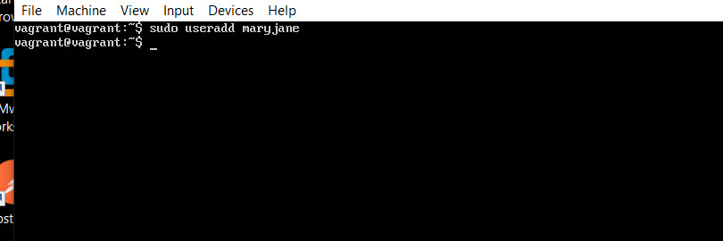
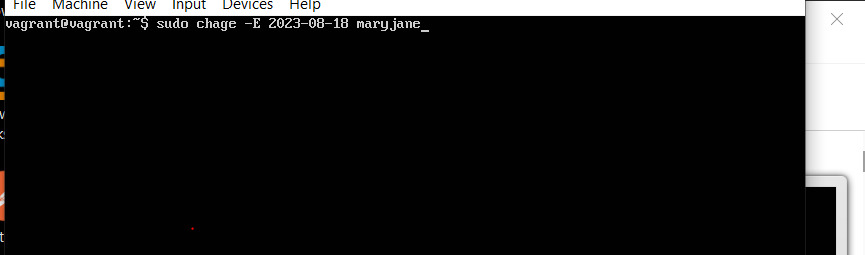
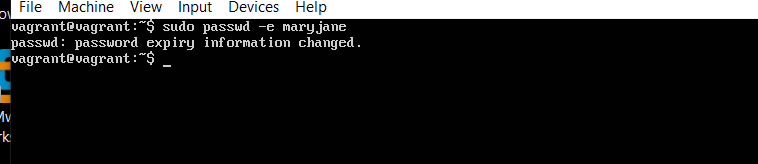
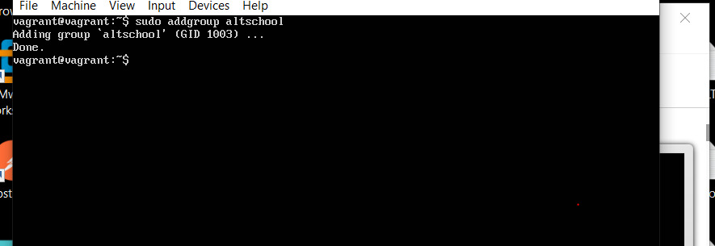
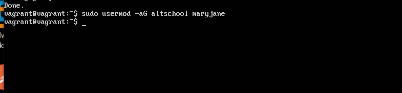
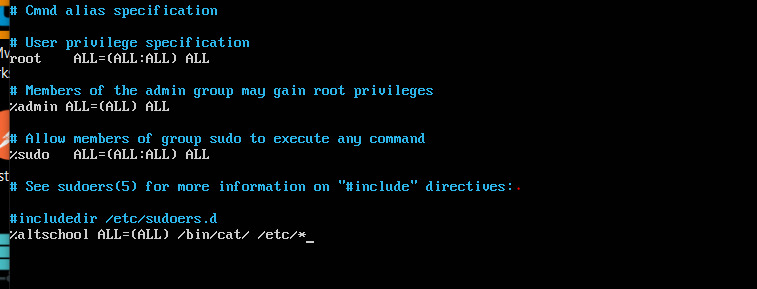
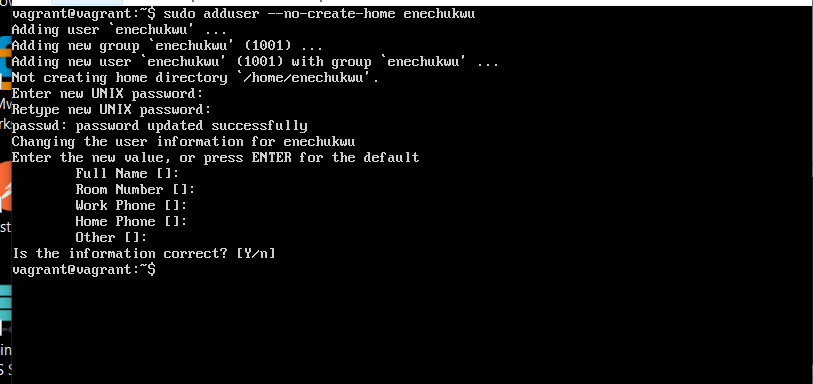

<!-- @format -->

# Assignment

#  Create a user

I created the command using my vagrant machine

# set an expiry date of 2weeks for the user

To add an expiry date for a new user, i used the "chage" command and add the "-E" flag, while setting the date for expiry

# prompt the user to change there password on login

 We made the user to change the password when they login , we used the "passwd" command and use the "-e" flag. it looks like this

# attach the user to a group called altschool

 it's a 2step process. we need to create a group and then add a user

I created a group using the "groupadd" command, see screenshot below

Then i added the user using the "usermod" and had to add aditional options for it to work "-ag"

#  allow altschool group to be able to run only cat command on /etc/

this step involves editing a particular file and adding some content to it

 Type visudo and open it with an editor add the content to the end of the file and then save

# create another user. make sure that this user doesn't have a home directory.

I used the "adduser" with the "--no-create-home" flag, so that it wont create a home directory for the user

